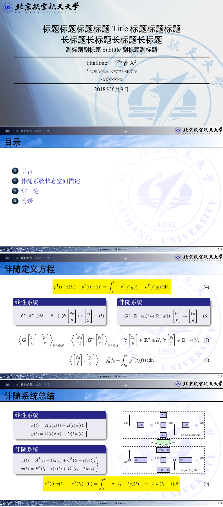
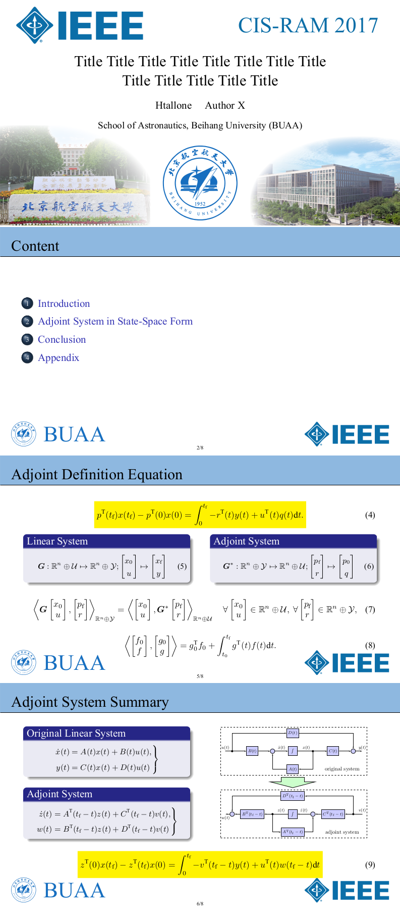

# 简单的幻灯片（presentation，PPT）LaTeX beamer模板

北航主题，或者说包含北航Logo。

主要是平时代替PPT，用于含有较多公式的presentation中，各种公式、矢量图片，编号、引用更方便一些。

参考了beamer自带的各种主题模板。关于字体、背景图片、Logo等样式，可以自己调整设计。

## beamerthemeBUAA

一个带有导航栏的beamer模板

模板文件 beamerthemeBUAA.sty
示例文件 presentation.tex

示例文件中有很多包是具体用到的，这里是多余的，并没有删掉。

支持中文，使用xelatex编译
```
xelatex presentation.tex
xelatex presentation.tex
xelatex presentation.tex
```

或者利用makefile
```
make presentation
```

截图如下，标题页的背景图片是从以前ppt模板里扒下来的，作者信息不明，可以自己重新设计：



## presentationBUAAIEEE

另一个简洁的beamer模板，是在参加IEEE国际会议时使用的，加入了IEEE的Logo和北航的Logo

模板文件 beamerthemeBUAAIEEE.sty
示例文件 presentationIEEE.tex


支持中文，使用xelatex编译
```
xelatex presentationIEEE.tex
xelatex presentationIEEE.tex
xelatex presentationIEEE.tex
```
或者利用makefile
```
make presentationIEEE
```
截图如下：


# License

主要参考了beamer自带的各种主题模板，所以就用与beamer相同的License。

